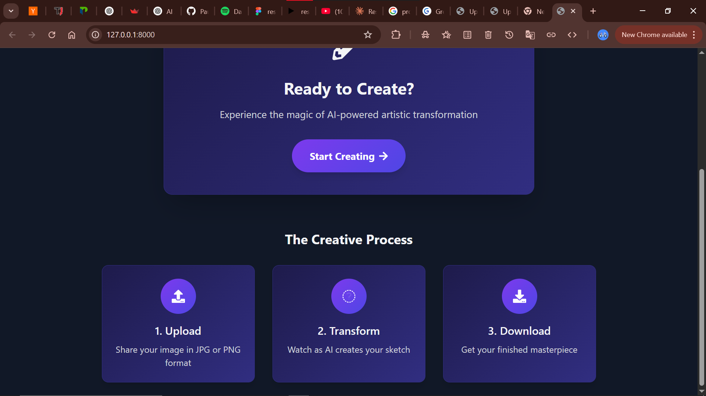

# 🎨 AI Sketch Studio


A Django-powered web application that transforms your images into beautiful artistic sketches and paintings using advanced computer vision techniques.

opencv + numpy image processing 

## ✨ Features

- **14 Artistic Transformations** - Convert images into various artistic styles:
  - Edge Sketch
  - Pen Sketch
  - Pencil Sketch
  - Watercolor Painting
  - Oil Painting
  - Charcoal Drawing
  - Digital Painting
  - Acrylic Painting
  - Pen and Ink
  - Spray Painting
  - Tattoo Drawing
  - Hatching Drawing
  - Calligraphy/Marker Drawing
  - 3D Drawing Effect

- **Modern UI/UX** - Clean, responsive interface with Tailwind CSS
- **Drag-and-Drop** - Easy image uploading
- **Real-time Processing** - Quick transformation with loading indicators
- **Download Options** - Save your favorite artistic renditions

## 🚀 Demo

### Home Page


### Upload Interface


### Results Gallery


<!-- [](screenshots/video.mp4) -->


<a href="https://youtu.be/hpH1V91qr18" target="_blank">
  
  
</a>

▶️ Click the image above to watch the video

## 🛠️ Technology Stack

- **Backend**: Django
- **Image Processing**: OpenCV, NumPy
- **Frontend**: HTML, CSS, JavaScript
- **Styling**: Tailwind CSS
- **Icons**: Font Awesome

## 🤖 How It Works

The application leverages OpenCV's powerful image processing capabilities to apply various artistic transformations:

1. **Edge Detection Algorithms**: Canny edge detection for sketch-like effects
2. **Bilateral Filtering**: For oil painting and watercolor effects
3. **Texture Simulation**: Random noise patterns for realistic art styles
4. **Morphological Operations**: For various drawing styles
5. **Color Space Manipulation**: HSV adjustments for vibrant digital art
6. **Adaptive Thresholding**: For pen and ink drawing effects

## 📋 Installation

### Prerequisites
- Python 3.6+
- pip

### Setup

1. Clone the repository:
```bash
git clone https://github.com/sayyedrabeeh/artist.git
cd sketch_project
```

2. Create a virtual environment:
```bash
python -m venv venv
source venv/bin/activate   
```

3. Install dependencies:
```bash
pip install -r requirements.txt
```

4. Run migrations:
```bash
python manage.py migrate
```

5. Start the development server:
```bash
python manage.py runserver
```

6. Open your browser and navigate to: `http://127.0.0.1:8000`

## 📁 Project Structure

```
sketch_project
|---- sketch_project/
├── sketchapp/              # Main Django app
│   ├── views.py           # Contains image processing functions
│   ├── models.py          # UploadedImage model
│   ├── forms.py           # Image upload form
│   ├── templates/         # HTML templates
│   │   ├── home.html      # Landing page
│   │   └── upload.html    # Upload and results page
│   └── ...
├── media/                 # Stores uploaded and processed images
├── static/                # Static files (CSS, JS)
├── manage.py
└── requirements.txt
```

## 🖼️ Image Processing Details

The application implements various artistic algorithms:

### Sketch Styles
- **Edge Sketch**: Uses Canny edge detection with dilation for clean line art
- **Pen Sketch**: Uses adaptive thresholding for a pen drawing effect
- **Pencil Sketch**: Combines inverted grayscale with Gaussian blur for realistic pencil texture

### Painting Styles
- **Watercolor**: Applies edge-preserving filter and stylization with paper texture
- **Oil Painting**: Uses bilateral filtering with sharpening for painterly strokes
- **Digital Painting**: Applies saturation enhancement and vignette effect
- **Acrylic Painting**: Combines bilateral filtering with noise textures

### Drawing Styles
- **Charcoal**: Uses Laplacian edges with grainy texture and contrast adjustments
- **Tattoo Drawing**: Applies adaptive thresholding and edge emphasis
- **Hatching**: Creates cross-hatching patterns based on image intensity
- **3D Drawing**: Combines depth maps with edge detection for dimensional effects

## 🔧 Configuration

The application accepts JPG images of any size. Large images will be processed without resizing, which may take longer but preserves quality.

### Customizing Image Processing

You can adjust various parameters in the image processing functions to modify the artistic effects. For example:

- Change `sigma_s` and `sigma_r` in the watercolor function for different stylization levels
- Adjust blur kernel sizes for more or less pronounced effects
- Modify contrast parameters for stronger or softer renditions

## 📝 Usage Tips

1. **Best Results**: Upload clear images with good lighting and minimal noise
2. **Processing Time**: Complex transformations like 3D Drawing may take longer
3. **Image Format**: Only JPG images are supported currently
4. **Resolution**: Higher resolution images produce more detailed artistic effects


## 👏 Acknowledgements

- OpenCV for incredible image processing capabilities
- Django for the robust web framework
- TailwindCSS for the modern UI design
- Font Awesome for beautiful icons